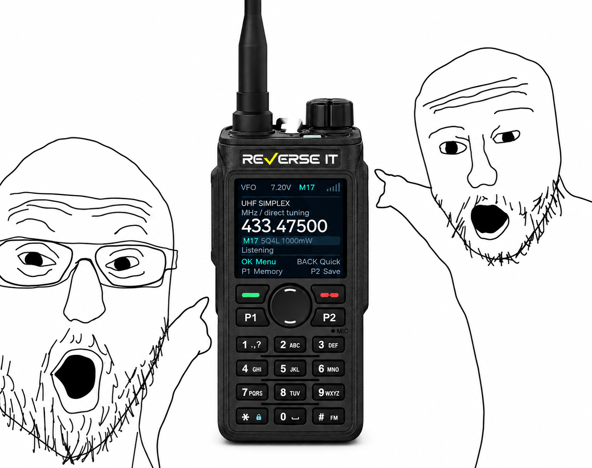
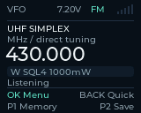
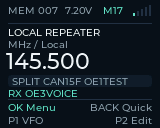
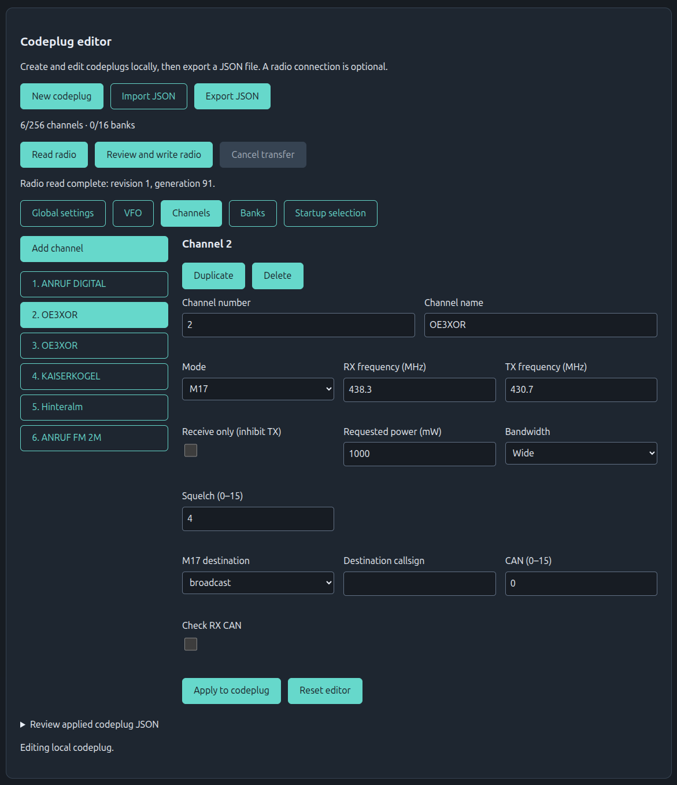
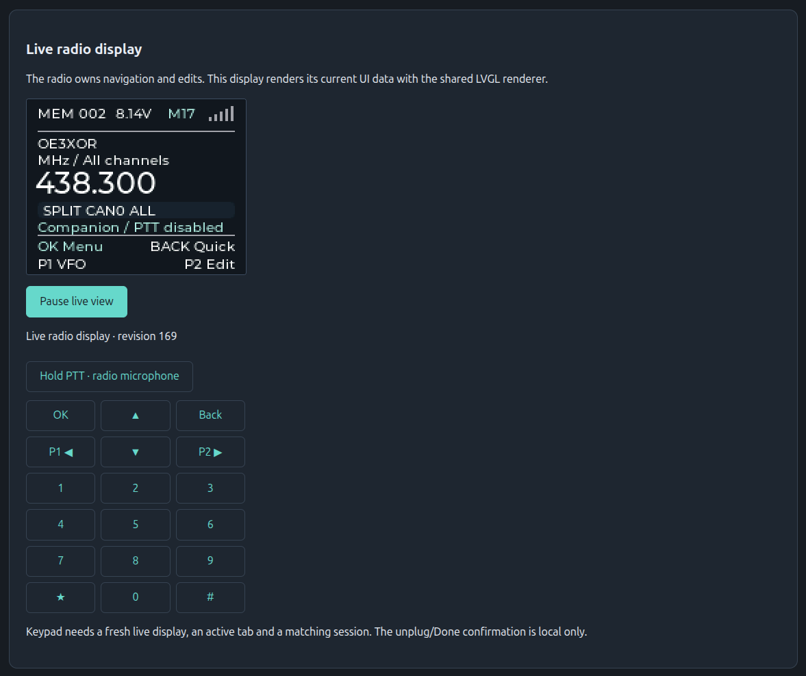
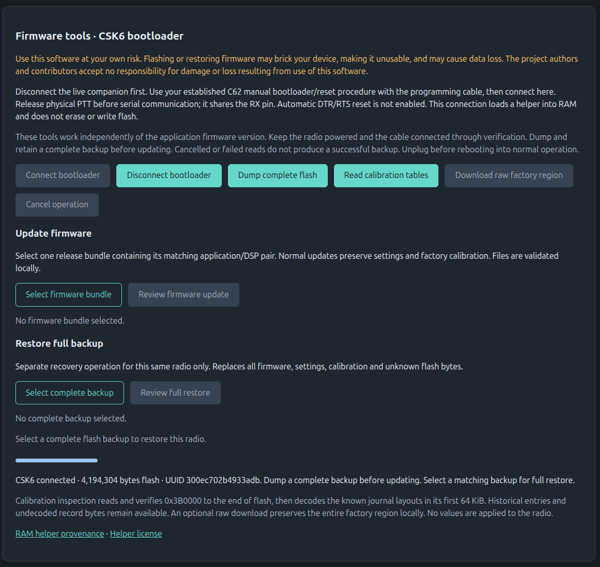

# OE3ANC HT

Experimental FM/M17 firmware for the C62 handheld, with a web companion and a
desktop emulator.

[Web companion](https://companion.oe3anc.at/) ·
[Releases](https://github.com/OE3ANC/oe3anc-ht/releases)

## Project status and disclaimer

This is experimental firmware that I develop and maintain for my personal use.
It provides a platform for testing ideas on the C62 and evaluating and improving
AI-assisted development workflows. AI tools are used extensively in development.

Ideas are welcome, but feature requests are not accepted, and fixes for reported
issues are not guaranteed. Continued maintenance depends on my interest in the
project; development may be discontinued.

Use it entirely at your own risk. Flashing or restoring may brick your radio or
lose data. I, and other authors and contributors, accept no responsibility for
broken devices, data loss or any other damage or harm.

For actual use, I recommend the better-designed and more stable
[OpenRTX](https://openrtx.org/). If you want to contribute to or support open-source
radio, support [M17](https://m17project.org/) and OpenRTX.

## Quick-start

1. Download the firmware ZIP for your chosen [release](https://github.com/OE3ANC/oe3anc-ht/releases)
   and extract `firmware-bundle.json`.
2. Open the [web companion](https://companion.oe3anc.at/) in a desktop browser
   with Web Serial support. Use the companion version matching your firmware release.
3. Put the C62 in manual bootloader mode and connect its programming cable.
   Release physical PTT, then select **Connect bootloader** under **Firmware tools**.
   Use **Dump complete flash** and keep the backup before updating.
4. Select `firmware-bundle.json`, choose **Review firmware update**, and select
   the application/DSP pair for the first installation. Review and acknowledge
   the prompts, then flash. Keep the radio powered and connected until completion.
5. Disconnect the bootloader, unplug the cable and reboot the radio. Enable
   **Companion** in the radio's menu before reconnecting the cable, then select
   **Connect** in the matching web companion. Use the codeplug editor to program
   channels or the live display and virtual keypad to control the radio.

If the radio reports **Storage is read-only** with **Load error -134** after using
an earlier development firmware, retain a complete flash backup and use
**Firmware tools → Review settings reset**. This deletes saved settings, channels
and banks, preserves firmware and factory calibration, and verifies the reset.
Disconnect, unplug and reboot, then read the radio again before uploading a codeplug.
Normal firmware updates preserve settings and do not clear this error.

## Features

### Firmware

- FM with independent RX/TX CTCSS or DCS, and M17 Codec2 voice with callsign
  addressing and CAN filtering.
- VFO and Memory operation, separate RX/TX frequencies, 256 channels and 16
  ordered banks. Edit them on the radio or share a JSON codeplug.
- Four themes, contrast settings, idle backlight dimming, keypad lock and a TX
  time limit. The desktop emulator runs the shared radio UI with fake hardware.

### Browser-based companion

- Offline and connected channel programming

- Shared LVGL live display and virtual keypad

- Separate bootloader tools for flash backups, application/DSP updates, optional
  post-write readback and read-only factory calibration inspection

## Acknowledgements

Thanks to everyone involved in reverse-engineering the C62, the OpenRTX
contributors, and the authors of the BK4819 driver and C62 integration we copied and
adapted as well as to ListenAI for their help with the DSP firmware. Their work
made this project possible. Imported code retains its original attribution and licenses.

We encourage amateur-radio manufacturers to publish tools, documentation and
schematics so the open-source community can develop innovative firmware and
extend the capabilities of existing hardware.

Project code uses GPL-3.0-or-later; see [license](LICENSES/GPL-3.0-or-later.txt) and the attribution above.
